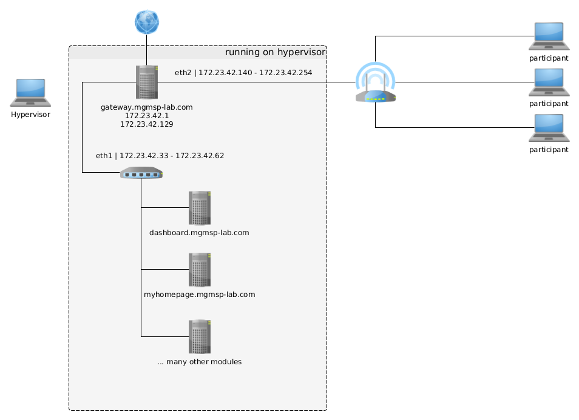
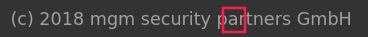

# NinjaDVA

**NinjaDVA** is not just another Damn Vulnerable Application. Its a mobile training environment for web application security. With its build-in vulnerabilities, it is the prefect environment to teach web application security while consolidating your knowledge through practical exercises.  With **NinjaDVA** you have found your all in one solution for your security trainings.

TODO: find better text!?

## Features

 * dashboard showing schedule, slides and links
 * single instance for multiple participants
 * administrative back-end allowing to observe the progress of the participants
 * participants can use their own notebooks (no custom software needed)
 * TODO: add more features

 ## Requirements
 * the latest version of `vagrant`
 * vagrant plugin: `vagrant-triggers` (installation via `vagrant plugin install vagrant-triggers`)

## Structure
The **NinjaDVA** suite consists of several components. All components are running on a hypervisor computer having Internet access and a switch or access-point attached.

**[gateway.mgmsp-lab.com]** is the central gateway for the suite. It provides the modules with a local domain name and assignees dynamic ip addresses to the participants.

**[dashboard.mgmsp-lab.com]** provides a central dashboard for the participants showing the actual slides, the schedule of the training and links. It consists of widgets. Some other components also provide widgets for the participants or the administrator.

**[myhomepage.mgmsp-lab.com]** is a webservice where participants can create their own websites. Additionally all websites provide a access-log and HTTP Headers can be defined.




The switch or access point attached to the hypervisor can be bridget to the gateway. Participants are connecting their computers to the network node and will get a IP address via DHCP. Access to the Internet is provides by the gateway using the uplink of the hypervisor.

## Start and Stop the NinjaDVA Suite
In order to start the **NinjaDVA** suite jump to the root of your cloned directory. There you can find a script called `./ninjadva`.
Use it to start, stop the suite, show the status and activate or deactivate components.

```
./ninjadva up -- start NinjaDVA components
./ninjadva halt -- shutdown all components
./ninjadva status -- show running components
./ninjadva change -- stop or start additional components
```

## First Start
If you start *NinjaDVA* for the first time, it has to setup its database and default configuration. Please follow these steps to get a correctly initialized **NinjaDVA**:

1. Attach a computer to the bridged switch/ access point provided by the gateway VM.
2. Open [http://dashboard.mgmsp-lab.com/](http://dashboard.mgmsp-lab.com/) in your browser
3. A text will tell you that a default config and a default password file was created.
4. Copy and save your password in a save place.
5. Reload the page.
6. You will see a text that tells you that the database was not created yet and asks you to visit [http://dashboard.mgmsp-lab.com/admin/setup_db.cgi](http://dashboard.mgmsp-lab.com/admin/setup_db.cgi)
7. Log in with the given password and the username `admin` if you are asked to provide credentials.
8. You are done! Returning to [http://dashboard.mgmsp-lab.com/](http://dashboard.mgmsp-lab.com/) you should see the empty dashboard.

See section *Administration* for further steps configuring your **NinjaDVA**.

## Administration
You can find the administration widgets for **NinjaDVA** by clicking on the `a` in `(c) 2018 mgm security partners GmbH`. Provide your admin credentials and click submit. The widgets will appear in the dashboard layout.



Currently you can find the following administration widgets:

* **Admin Layout** -- Save your layout configuration to the server
* **Admin Calendar Config** -- Configure the start time and the slot duration of the calendar
* **Admin Default Slide** -- Set the default slide for the document viewer
* **Admin Links** -- Add, delete and activate Links
* **Admin Calendar Events** -- Add, manipulate und delete events in the calendar
* **Admin Weather** -- Configure the title, image and location for the weather
* **Admin Files** -- Lists all available files provides links to it

Additional **NinjaDVA**-Modules can provide additional admin widgets.

There is a admin dashboard whe you can see challenges and the progress of your participants. You can reach it under [http://dashboard.mgmsp-lab.com/admin/](http://dashboard.mgmsp-lab.com/admin/). In the lower part of the screen you can see the active challenges. Modules can add challenges. Click on a challenge to see how the participants perform.

## Add additional Modules
There is a great variety of free and commercial **NinjaDVA**-Modules. The most popular free module is the [NinjaDVA-clock](https://github.com/mgm-sp/NinjaDVA-clock). You can add new modules to your **NinjaDVA** suite by cloning them in the root-directory of your **NinjaDVA**-installation. The `./ninjadva` starter script will detect the new modules automatically.

## Develop own Modules
You can develop your own modules for **NinjaDVA**. Just create a Virtual Machine based on VirtualBox managed by Vagrant. Create a new directory in your **NinjaDVA** root directory. Place your `Vagrantfile` and all files you need there. In order to interact with the **NinjaDVA** suite, there is a structure of reserved directories:

```
your_vulnerable_vm/
    Vagrantfile
    <other files or dirs you need>
    ninjadva/
        challenge-descriptions/
        dashboard-widgets/
        dashboard-admin/
```

In `challenge-descriptions/` you can define challenges. See section *Define Challenges* to find out how to define them. Dir `dashboard-widgets/` contains HTML-Files that will be rendered as Widget on the dashboard. The NinjaDVA-clock widget is an example for such a widget. Last but not least in `dashboard-admin/` you can place widgets that are available for the admin only. For the most part these are used to allow the administrator to configure the modules from the dashboard. See the example widgets or the section **Define Widgets** to get an idea how to define them.

In order to interact with the **NinjaDVA** suite add the following lines to your modules `Vagrantfile`:

```
Vagrant.configure("2") do |config|

    .......your VM configuration .............

	#----------------- NinjaDVA specific configuration -------------------------------

	if File.exists?("../ninjadva.rb")
		require "../ninjadva"
		NinjaDVA.new(config)
	end
end
```

This will inject `ninjadva.rb` to your Vagrant configuration. Among other responsibilities, the script is responsible for installing the `ninjasolver` program in your VM, allowing you to send the information that a participant solved a challenge. See the section *Submit Solutions* for further details.


### Define Challenges
You can define challenges that are shown in the admin dashboard. Challenges are defined in YAML files. See the following example:

```
---
:description: |
 Try to get access to the email account of Mr. Schmidt via cross-site scripting. The Solution is the middle name of Mr. Schmidt.

 Hint: Mr. Schmidt is part of the support team. He will read all incoming chat messages in the mail-service support chat.

:category: "XSS"
:name: "Steal the Session ID"
:value: 10
:keys:
  - "xaver sebastian"
  - "xaver sebastian schmidt"
:solutions:
  - <script>document.write("")</script>
  - <script>document.getElementById("message").value=document.cookie;document.getElementById("chat").submit()</script>
```

The name of the YAML file defines the name under which the administrator will see the challenge. Value limits the highest score one can reach in the challenge. Keys are currently not used in the suite but you can use them to feed a capture the flag scoreboard like [CTFd](https://ctfd.io/). Solutions are shown to the administrator in order to help the participants or demonstrate one possible solution.


### Define Widgets
You can add widgets for participants or the administrator to the dashboard. The dashboard is using `gridster.js` as layout engine. Define your widgets like the following example to make them available at the dashboard. Based on historical reasons, dashboard widgets and admin widgets are defined in a different way. Find an example for both in the corresponding folders. The `<h1>` tag is mandatory because it is the drag-drop-element for your widget. You can add JavaScript as shown in the examples. Feel free to use jQuerry.

### Submit Solutions
In order to submit solutions to the dashboard, there is the `ninjasolver` script installed. Use it like described in te help statement:

```
ninjasolver [options]
-r   (required) url of the solution handler script on the dashboard vm
-i   (required) ip address of the participant solved the challenge
-c   (required) category of the solution
-s   (required) state of the challenge
-m   (optional) message for the trainer

Example:

ninjasolver -r http://dashboard.mgmsp-lab.com/solve_srv.cgi -i 172.23.42.137 -c some_challenge -s 7 -m 'Ben solved something'
```

## Advanced Configuration
TODO: 
 * how to change password
 * how to change customer
 * how to change domain